# 小组件使用说明

## 0.重要说明

### 0.本组件的代码框架来自

> #### https://gitee.com/JaxsonWang/scriptable-audi/
>
> 在此表示感谢

### 目前版本的最终效果：

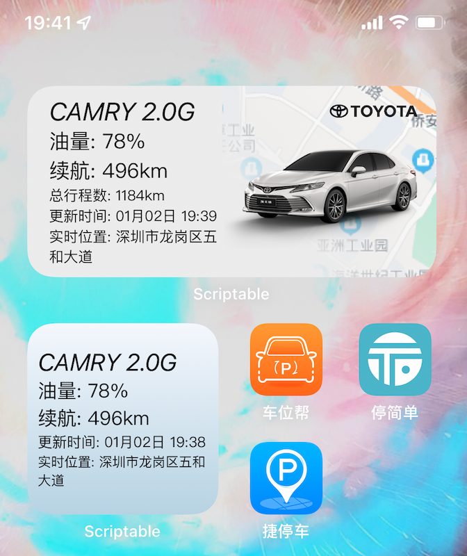

### 1.本组件为本人空余时间开发，请勿用作商业用途；

### 2.其数据来之丰运行App，因为该App使用的网易云顿，无法直接从小组件登录，所以需要抓取Cookie和鉴权信息；

### 3.切记请妥善保管该信息，不要泄露给其他人；

### 4.该组件没有收集您的用户信息，相关信息保存在你的手机上，你可以随时清除掉该信息；

### 5.目前只完成的中组件，所以使用Scriptable时请选择中组件，大组件等有空了再开发；

### 6.如果你不同意上面所说的，请立即关闭该文档，请不要使用，谢谢

### 7.在设置白名单之前要先把CA证书安装好，要是先设置白名单，再去配置CA证书的话，会打不开下载CA证书的页面

### 8.关于打开Stream打开抓包时，丰云行无法联网的问题，需要你在Stream白名单里面添加`carapp.gtmc.com.cn`即可，如下图添加白名单

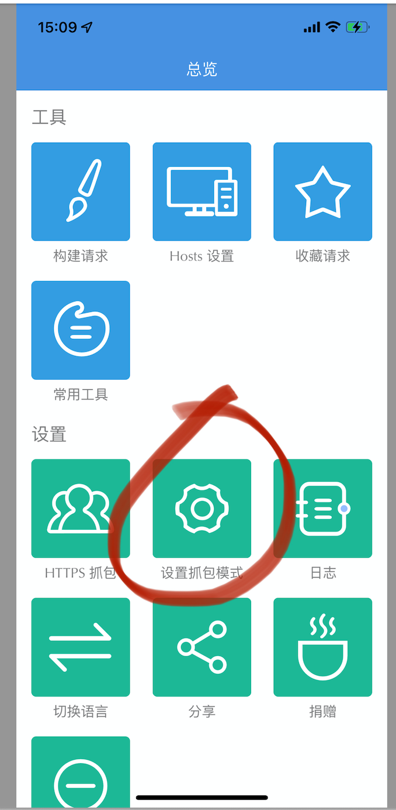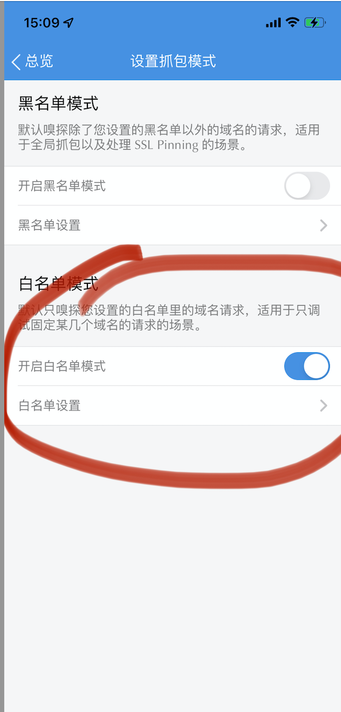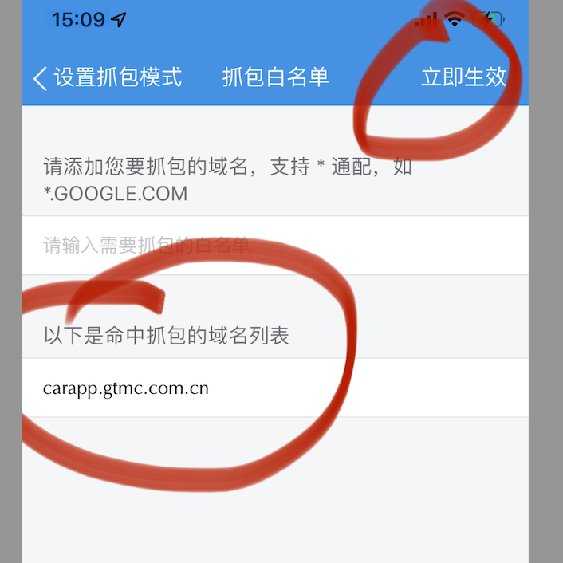

## 1.前提准备

请下载好Scriptable和Stream，这两个软件都是免费的

Scriptable下载：https://apps.apple.com/us/app/scriptable/id1405459188?l=zh

Stream下载:  https://apps.apple.com/us/app/stream/id1312141691?l=zh

Stream抓包使用方法请看(这里是教你怎么用Stream，和我们的目标不相关，可以不用仔细看):  https://www.cnblogs.com/hong-fithing/p/12562448.html

因为我们是要抓取https的请求，所以直接看抓包实践：https://www.cnblogs.com/hong-fithing/p/12562448.html#tid-jX5wxr

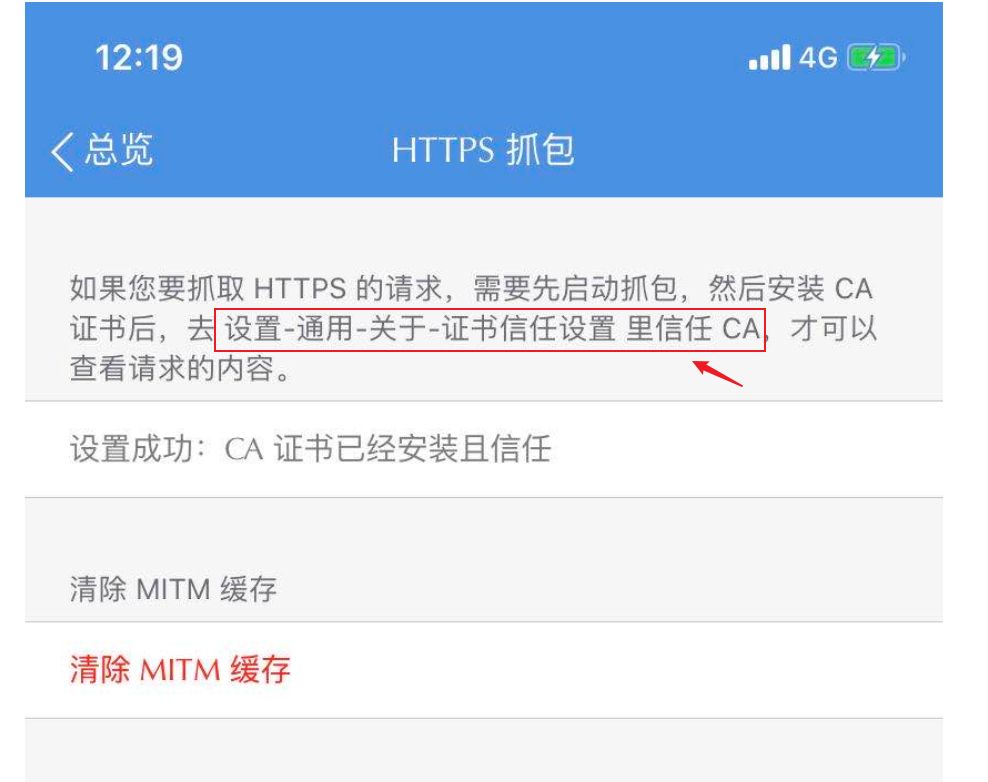

如上图所提示的，必须在系统信任CA证书才可以，信任路径

### 设置-通用-关于本机-证书信任设置-Stream Generated开关打开

## 2.获得百度地图AK

因为只能得到汽车的经度和纬度，所以需要使用到百度地图进行地理反编码得到具体的地理位置

### 1.请先注册百度地图的开发者

#### 注意：认证百度开发者需要您的身份证信息，这个信息是发生给百度的，我并没有得到您的身份证信息，要是不想认证百度开发者，请您麻烦关闭该文档，请不要使用，谢谢！！！

注册开发者地址：https://lbsyun.baidu.com

注册成开发者可能需要身份证相关的信息

### 2.在百度地图控制台添加应用

百度地图控制台：https://lbsyun.baidu.com/apiconsole/center#/home

在控制台右边依次点击：应用管理 - 我的应用 - 创建应用

#### 1.创建应用

如下图：

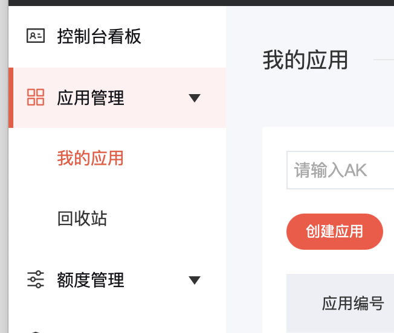

#### 2.输入相关信息

注意：应用类型要选【浏览器端】，其他默认即可，最后的Referer白名单输入*

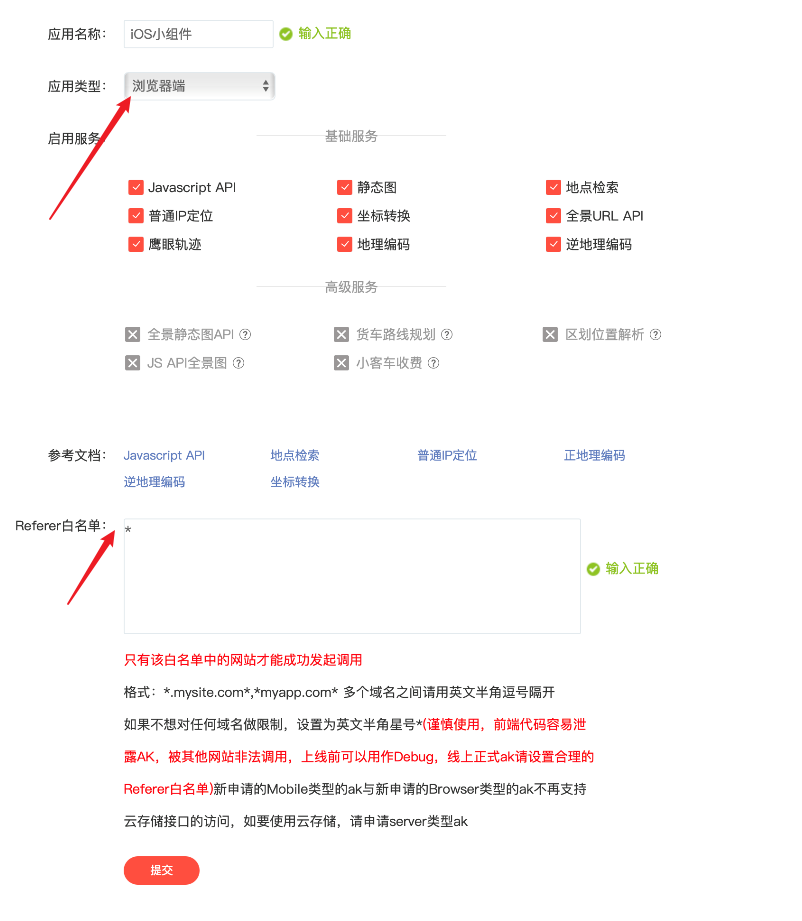

#### 3.复制AK

返回到我的应用，复制AK

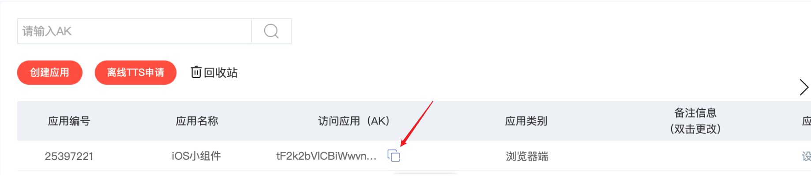

## 3.下载js文件

打开链接: https://gitee.com/GhostClock/gc-camry-ios/raw/master/GC-Camry-iOS.js

复制全部内容后打开Scriptable

注意：因为在浏览器里面呈现的代码非常长，不好手动粘贴，推荐下面的使用捷径，可以一键复制（需要允许相应的权限）

https://www.icloud.com/shortcuts/75fd371e0aa8438a89f715238a21ee68

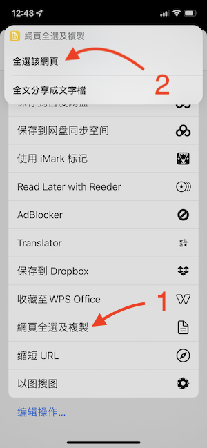

## 4.抓包获得丰云行Cookie信息

### 1.先把丰运行退出登录，再打开Stream，点击【开始抓包】

### 2.登录丰运行，在丰运行App里面完成所有的登录动作后，且已经显示了主页面

### 3.回到Stream，点击【关闭抓包】

### 4.打开抓包历史，点击最近的一次抓包记录，再点击【按域名】排序，找到`carapp.gtmc.com.cn`

### 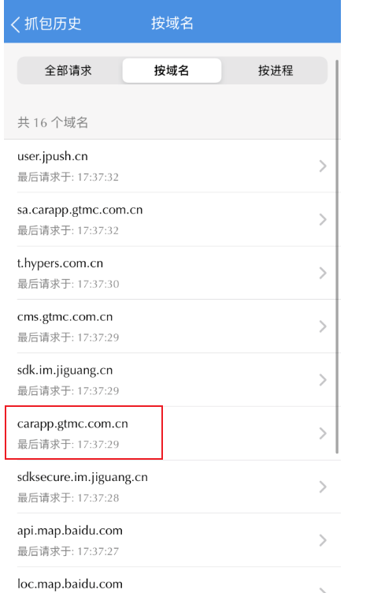

### 5.在右上搜索关键字`AppUser.json`,点击确定 (注意如果您是使用的密码登录，请搜索`appUserLogin.json`)

### 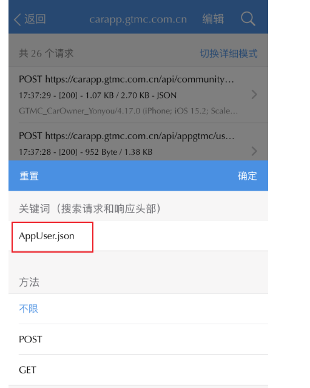

### 6.在搜索记录点击该请求，再点击【响应】，【查看响应】

### 7.拷贝全部数据

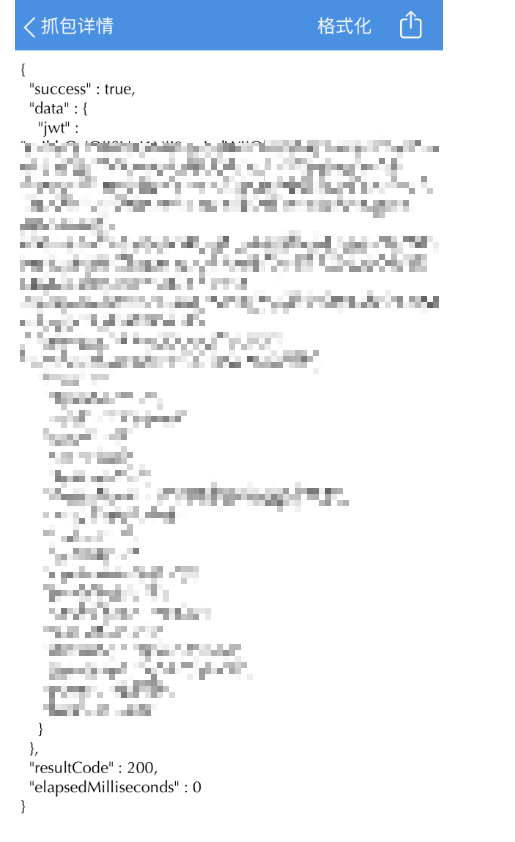

如果您不好复制，可以点击右上角的剪头-点击分享-拷贝

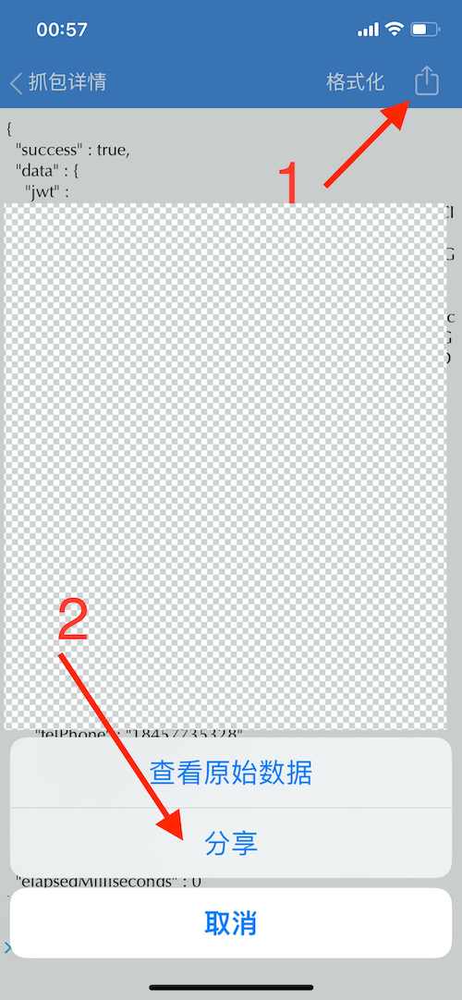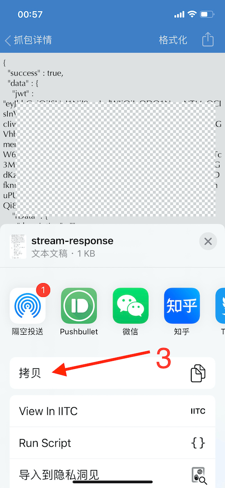

## 5.运行Scriptable

在Scriptable的右上角点击【+】，粘贴全部内容，最后点击右下角的【三角号】运行

在弹出的输入第4步得到的Cookie信息和百度AK

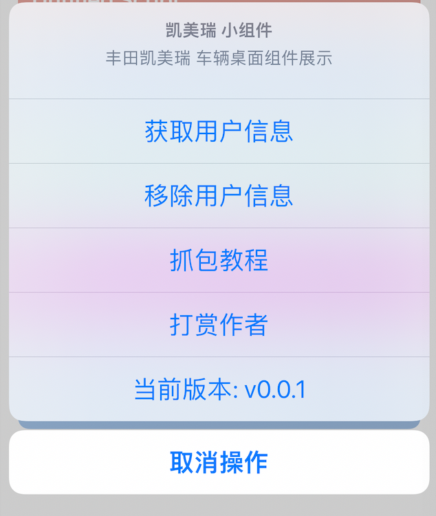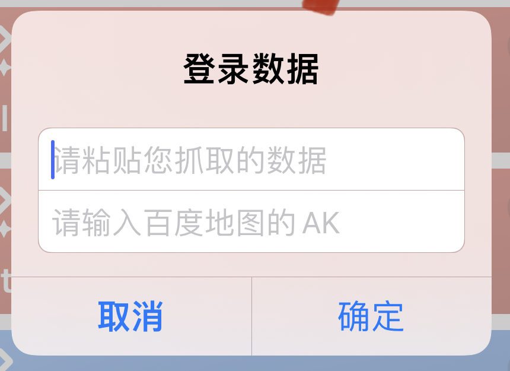

## 6.添加小组件到桌面上

### 1.在手机桌面空白处长按，右上角点击+

### 2.找到Scriptable，添加小组件或者中组件

### 3.回到桌面，长按添加你的组件

### 4.点击编辑组件，选择当前的组件列表

### 5.等待刷新即可

## 7.打赏

开发不易，请我喝杯奈雪吧 ^_^

 

## 8.加群

点击链接加飞机群：

https://t.me/GhostClock_Camary

